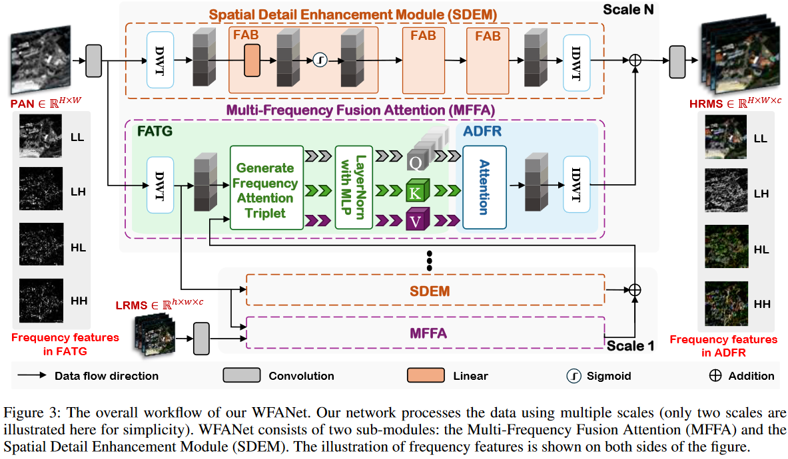
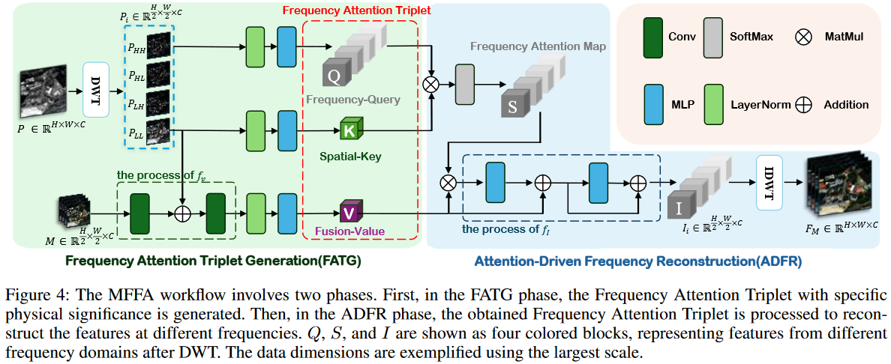

# Wavelet-Assisted Multi-Frequency Attention Network for Pansharpening [AAAI 2025]

  
    <a href="https://arxiv.org/pdf/2502.04903">Arxiv</a>
    <!-- 
    <a href="https://openreview.net/pdf?id=QMVydwvrx7">NeurIPS 2024 -->

 

  </a>
    Abstract:
    Pansharpening aims to combine a high-resolution panchromatic (PAN) image with a low-resolution multispectral (LRMS) image to produce a high-resolution multispectral (HRMS) image. Although pansharpening in the frequency domain offers clear advantages, most existing methods either continue to operate solely in the spatial domain or fail to fully exploit the benefits of the frequency domain. To address this issue, we innovatively propose Multi-Frequency Fusion Attention (MFFA), which leverages wavelet transforms to cleanly separate frequencies and enable lossless reconstruction across different frequency domains. Then, we generate Frequency-Query, Spatial-Key, and Fusion-Value based on the physical meanings represented by different features, which enables a more effective capture of specific information in the frequency domain. Additionally, we focus on the preservation of frequency features across different operations. On a broader level, our network employs a wavelet pyramid to progressively fuse information across multiple scales. Compared to previous frequency domain approaches, our network better prevents confusion and loss of different frequency features during the fusion process. Quantitative and qualitative experiments on multiple datasets demonstrate that our method outperforms existing approaches and shows significant generalization capabilities for real-world scenarios.
</a>

News:

- 2025/4/11：**Weights RELEASED!**:fire: 

- 2025/2/7：**Code RELEASED!**:fire: 

- 2024/12/11: **Code will be released soon!**:fire: 

## Quick Overview

The code in this repo supports Pansharpening.

# Instructions

## Dataset

In this office repo, you can find the Pansharpening dataset of [WV3, GF2, QB and WV2](https://github.com/liangjiandeng/PanCollection).

## Convenient Access to Results and Support for Beginners

If you need to use our methods as a benchmark, there is no need to retrain the models yourself. For your convenience, we can send you the complete mat files for WV3, GF2, QB, and WV2. In addition, to better support beginners, we can provide you with the source PowerPoint files containing plots from multiple papers we have collected, as well as a comprehensive writing guide.
Due to file size limitations and data security considerations, please contact us via email (jayhuang303hh@gmail.com) if you need these resources.

## Citation

If you find our paper useful, please consider citing the following:
@article{huang2025wavelet,
  title={Wavelet-Assisted Multi-Frequency Attention Network for Pansharpening},
  author={Huang, Jie and Huang, Rui and Xu, Jinghao and Pen, Siran and Duan, Yule and Deng, Liangjian},
  journal={arXiv preprint arXiv:2502.04903},
  year={2025}
}

